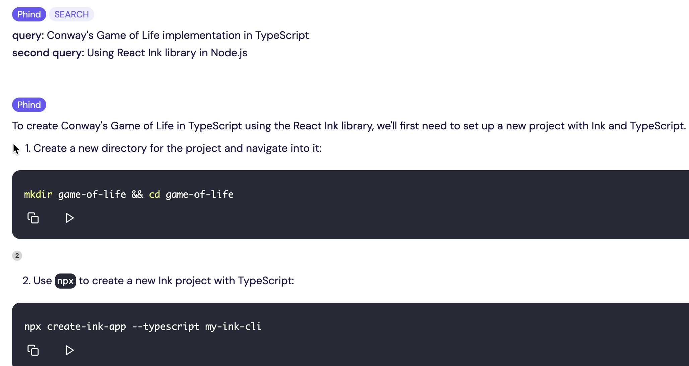
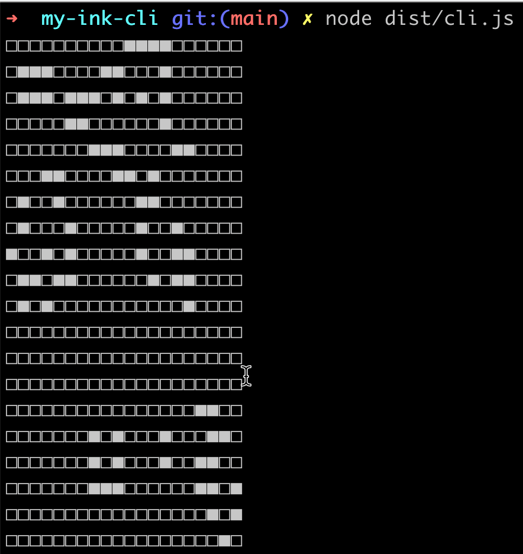
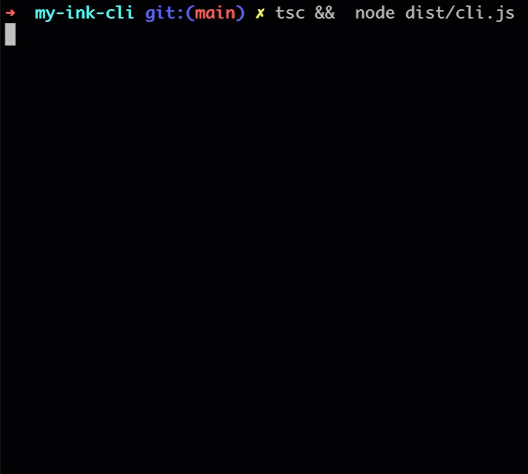
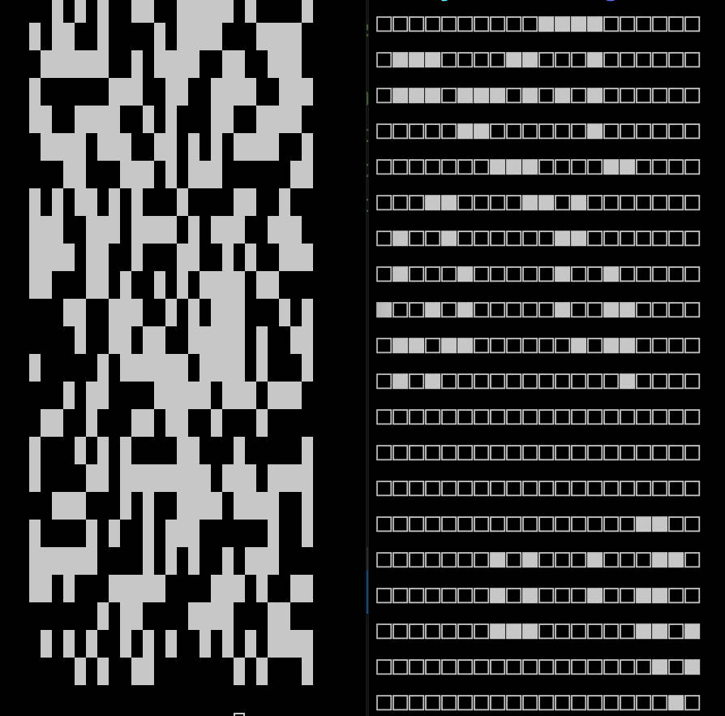
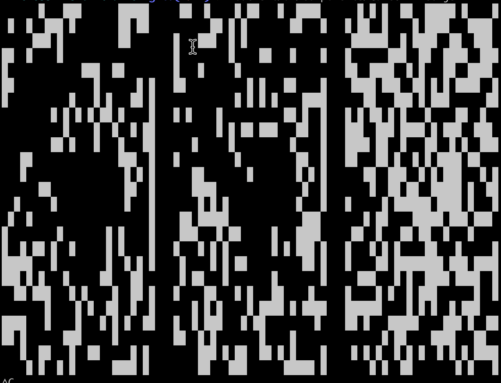

Goal: Compare two code-generating AIs - phind.com, and Github Copilot - by having an experienced developer use them both to implement a version of Conway's Game of Life.

Reference: Conway's Game of Life

Process (more or less as actually done):

- Ask phind for "Conway's Game of Life implementation in TypeScript", and follow instructions:

- Realize that it had provided for board generation and evolution, but included no way to visualize it!

- Refine query to include "Using react-ink library in NodeJS". 

- At this point it did something amazing - it wrote the code to turn the internal array-of-arrays into nested JSX view objects specific to the react-ink library. This enabled me to get this screenshot of a board.  

- A great start for phind.com. At this point, however the board was not animated and regularly evolving.

## Github copilot

The phind.com AI included full instructions for the game, starting  from creating a folder for it and installing dependencies. Then it wrote its code.

While Github Copilot can also give step-by-step instructions that read like a blog post, it excels at helping you write or extend code in your editor. So I used a little knowledge I had about the RxJS library in JavaScript, to ask Copilot to _"Write Game of Life in TypeScript"_, but I included the instruction to:

> _Represent the board as an Observable of board stages of evolution._

And it gave me an Observable - basically a data structure - for a stream of boards, rather than just a single board. At this point I asked it to:

> _Print out each new generation of the board on the console._

Which let me see the board represented as arrays of `false` and `true`. But this time the board was evolving per the rules of Game of Life.

I asked it now to:

> _Use the react-ink library to draw each stage of evolution of the board to the console._

And it rewired the Observable of board states to render `react-ink` Boxes to the screen, and now it was fully live-updating!

---

Here are the two GoL implementations side by side:

But to get some screenshots that show the evolution of the board over time - I wanted to see 3 generations at once. No problem! 

> _Now show 3 generations at once, side-by-side, updating from left to right._

